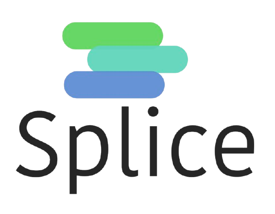

<div align="center">



<tr>
    <td>
        <a href="https://github.com/sinhateam"></a>
    </td>
</tr>

[](https://github.com/Open-Splice/Splice/actions/workflows/main.yml)
<!-- Copy-paste in your Readme.md file -->

<!-- Made with [OSS Insight](https://ossinsight.io/) -->
[](https://open-splice.github.io/SpliceDocs/)

[](https://www.reddit.com/r/OpenSplice/)

[](https://app.gitter.im/#/room/#splice:gitter.im)

[](https://github.com/Open-Splice/Splice/actions/workflows/codeql.yml)

# **Introducing Splice - a new programming language designed for embedded systems and small devices!**

Splice is an Open-Source, high-level, Dynamic Programming language developed by Open-Splice, A Sinha Group organization, to make writing code for embedded systems easier. This is the main Github repo where all source code of Splice remains. Installation of Splice can be found below.

## Core Benefits of Splice

Splice is designed around the ideas outlined in `Splice.pdf`: a language and VM that remain portable, compact, predictable, and maintainable enough to fit embedded and system-adjacent use cases.

### 1. Write Once, Run Anywhere

Splice aims for real portability across supported targets so behavior stays consistent instead of depending on platform-specific runtime quirks.

### 2. Small Runtime Footprint

The runtime is intended to stay compact, making Splice a better fit for constrained systems where memory and storage matter.

### 3. Predictable Execution

Execution is designed to be easier to follow and reason about, which helps when debugging, profiling, or validating behavior on small devices.

### 4. C-Level Integration

Splice is built with low-level host integration in mind so it can work alongside existing systems code instead of requiring a completely isolated runtime model.

### 5. Fast Startup

A smaller runtime and simpler execution model support quicker startup, which is useful for tooling, embedded tasks, and short-lived processes.

### 6. Custom Bytecode

Splice uses its own bytecode approach so the VM and language can be shaped together around clarity and control instead of inheriting a heavier generic model.

### 7. Minimal Dependency Chain

The design tries to keep the toolchain understandable and lightweight, which reduces friction when building, porting, or embedding the project.

### 8. Explicit Language Design

Splice favors explicit architecture choices so the behavior of the language and VM is easier to inspect, document, and maintain over time.

### 9. Embeddable VM Architecture

The VM is meant to be embeddable, allowing Splice to fit into larger host applications and device-oriented environments.

### 10. Customizable Memory Model

Different targets need different tradeoffs, so the design leaves room for memory handling choices that better match constrained hardware.

### 11. Stable Cross-Platform Behavior

Consistency across platforms is a core goal so the same program model can remain reliable as Splice expands to more targets.

### 12. Language and Toolchain Control

Owning both the language design and runtime model gives the project tighter control over how code is represented, executed, and debugged.

### 13. Good Fit for System-Adjacent Software

Splice is aimed at software that lives close to the system, where visibility into execution and runtime behavior matters.

### 14. Low Cognitive Overhead

The project emphasizes readable internals and a smaller conceptual surface area so developers can understand what the runtime is doing without digging through unnecessary complexity.

### 15. Long-Term Maintainability

The broader design goal is not just performance on day one, but a runtime and language model that can remain understandable and maintainable as the project evolves.

## How does Splice work?

Splice does not use traditional numeric opcode-based bytecode
(e.g. `0xA1 → LOAD`).

Instead, it uses **KAB (Keyword Assigned Bytecode)**:

- Bytecode instructions are represented using readable keywords
- The VM directly interprets these semantic instructions
- This simplifies debugging and tooling around bytecode

This design reduces interpreter complexity and makes the bytecode easier to inspect, debug, and maintain across platforms.

The current SPVM runtime has been tested on desktop platforms and is designed with microcontrollers such as the **ESP32** in mind.

``` text
Splice Source Code 
↓ 
Lexer 
↓ 
Parser (AST) 
↓ 
Bytecode Builder 
↓ 
Stack Virtual Machine 
↓ 
Execution
```

## How to Install?

It is recomended to use our ```build.sh``` and not any third party ```build.sh``` as they could cause harm to your system.
To run Build.sh run
``` ./build.sh ```.
If you have a corrupted version of Splice run ```./build.sh --force``` to forcefully rewrite the corrupted version with the right one.

## Source Code Orginization

Splice is orginized in this manner

| Directory         | Contents                                                           |
| -                 | -                                                                  |
| `src/`            | Code to run the SPVM (Splice Virtual Machine) onto systems like Microcontrollers                         |
| `examples/`        | Example code that works with Splice                                              |
| `test/`     | A Directory for Where CodeQL and Github CI Test Splice |
| `bin/` | A Directory where compiled versions of Splice stay. Contents only exist when you install Splice for your system |
